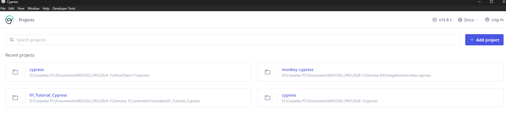
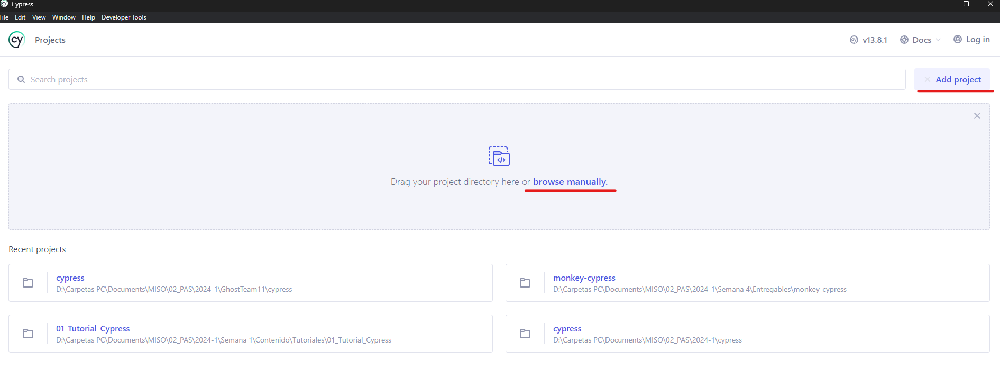
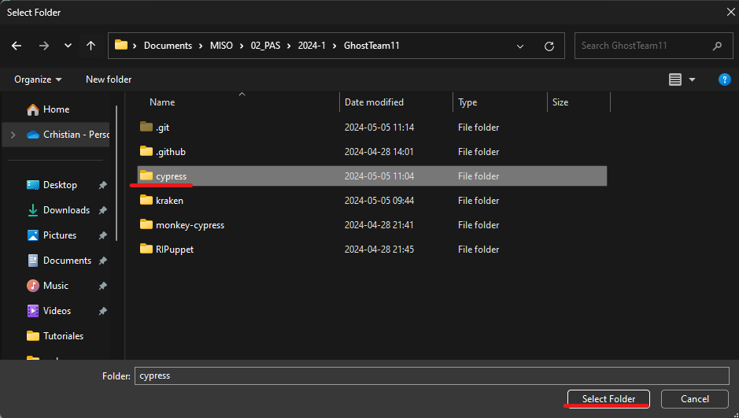
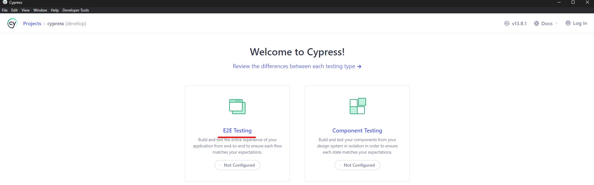
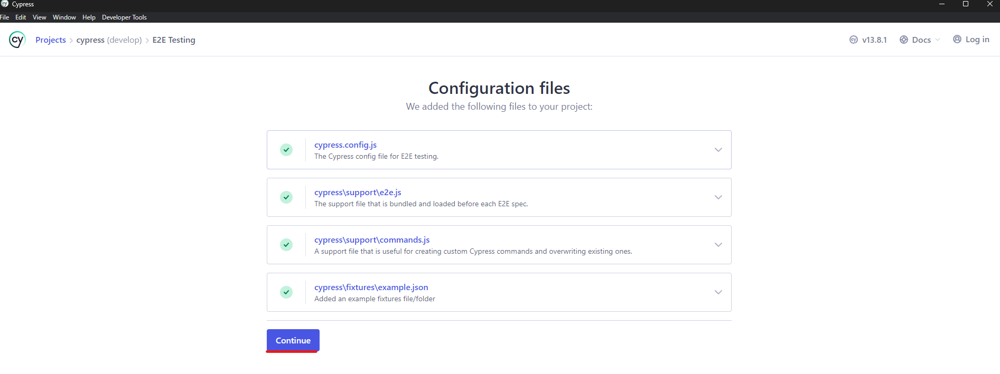
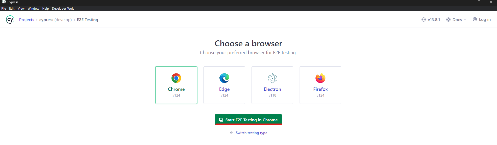
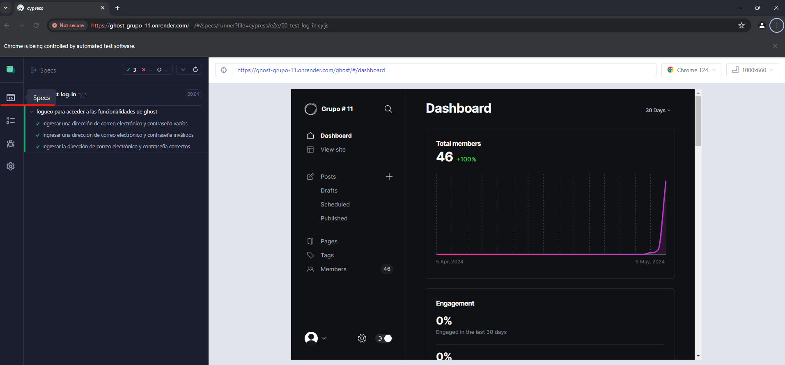

# Ejecutar pruebas automatizadas E2E con Cypress

## Versiones usadas

> En cuanto a las versiones que se usaron para correr las pruebas en esta herramienta, tenemos las siguientes:
>
> - **Node:** 20.12.2
> - **npm:** 10.5.0
>
> Estas versiones fueron instaladas descargando la última versión con soporte a largo plazo (LTS) presente en la página de [node](https://nodejs.org/en/).

## Instalación y ejecución

A continuación se detallan los pasos para realizar la correcta ejecución de las pruebas automatizadas E2E con la herramienta **Cypress**:

1. Clonar este repositorio con el comando 

    `git clone https://github.com/jmblancor1/GhostTeam11.git`

2. Abrir un consola cmd o git bash en la ruta donde se haya clonado el repositorio.

3. Ubicarse en la ruta `\cypress`.

    `cd cypress`

4. En un explorador de archivos, ubicar en esta ruta el archivo `package-lock.json` y eliminarlo.

5. Instalar las dependencias requeridas con el comando 

    `npm install`.
6. Instalar la dependencia de xpath
    `npm install -D cypress-xpath`   

8. Ejecutar las pruebas con el comando 
    
    `cypress open`.

9. Se debe abrir una instancia de Cypress para configurar las pruebas a ejecutar.

8. Dar clic en _Add project_ y luego en _browse manually_.

9. Seleccionar la carpeta _cypress_ presente en la raíz del repositorio y dar clic en _Select folder_.

10. Seleccionar la opción _E2E testing_.

11. Dar clic en _Continue_.

12. Dar clic en _Start E2E testing in Chrome_. Este paso abrirá una instancia del navegador Chrome para ejecutar las pruebas E2E.

13. Dar clic en cada test a ejecutar.

14. Para volver al listado de pruebas y ejecutar otro test, se debe dar clic en _Specs_.

15. Repetir los pasos 13 y 14 hasta finalizar la ejecución de todas las pruebas.
